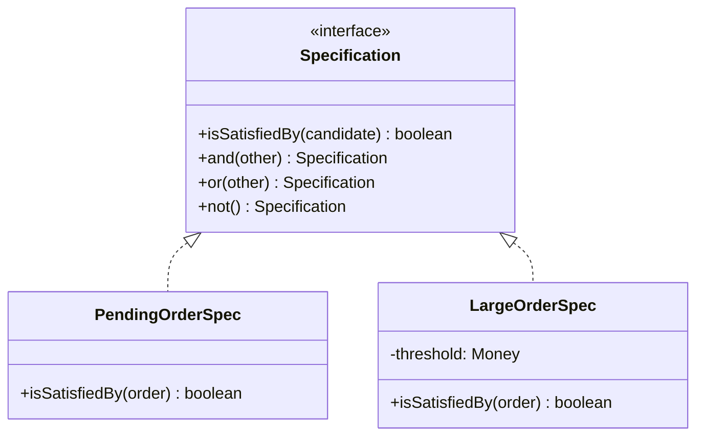

# DDD-SPECIFICATION — Specification Pattern

**Layer:** 2 (contextual)
**Categories:** software-design, ddd, object-oriented, domain-logic
**Applies-to:** all

## Principle

Encapsulate a business rule or criterion in a separate **Specification** object with a single `isSatisfiedBy(candidate)` method. Specifications can be combined with logical operators (`and`, `or`, `not`) to build complex rules from simple ones. This moves business logic out of repositories, services, and query strings into named, testable domain objects that speak the Ubiquitous Language.

## Why it matters

When selection criteria are expressed in ad-hoc query strings, service methods with boolean flags, or inline conditionals scattered across the codebase, the business rules become invisible. Changing a rule requires finding and updating every place it appears. Specifications give business rules a name, a location, and a type — they can be tested, composed, and passed as arguments without leaking their implementation.

## Violations to detect

- Selection logic duplicated in multiple repository methods, service calls, and UI filters that all implement the same underlying business rule
- Repository methods with boolean parameters (`findOrders(boolean isPending, boolean isLargeOrder)`) — each combination should be a named specification
- Business rules expressed as raw SQL fragments, JPQL strings, or predicate lambdas inline at the call site, with no reusable named object
- Complex eligibility or validation rules written as multi-condition `if` chains that cannot be passed, stored, or composed

## Good practice

```java
// Violation — rule duplicated and anonymous at every call site
List<Order> largeOrders = orders.stream()
    .filter(o -> o.getStatus() == PENDING && o.getTotal().compareTo(THRESHOLD) > 0)
    .collect(toList());

// Correct — named, composable, testable specifications
Specification<Order> isPending = new PendingOrderSpec();
Specification<Order> isLarge   = new LargeOrderSpec(THRESHOLD);
Specification<Order> needsReview = isPending.and(isLarge);

List<Order> result = orderRepository.findBy(needsReview);
```



- Name specifications after the business rule they encode, using the Ubiquitous Language
- Implement `and`, `or`, and `not` as combinators on the base interface (or as decorator classes)
- Keep each specification focused on one rule; combine rules through composition
- Use specifications in repositories (query translation), in domain services (validation), and in factories (eligibility)

## Sources

- Evans, Eric. *Domain-Driven Design: Tackling Complexity in the Heart of Software*. Addison-Wesley, 2003. ISBN 978-0-321-12521-7. Chapter 9, "Specifications."
- Fowler, Martin, and Eric Evans. "Specifications." 1997. https://martinfowler.com/apsupp/spec.pdf (accessed 2026-03-16).
