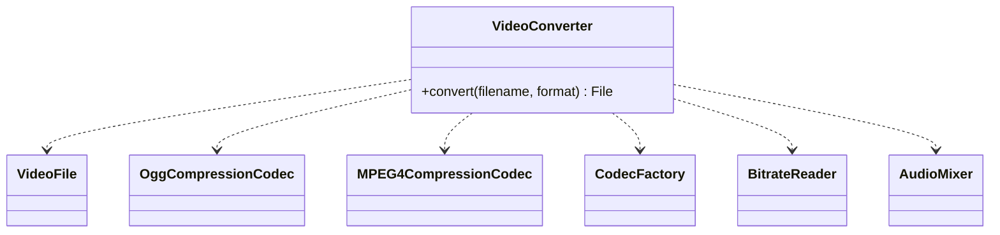

# GOF-FACADE — Facade Pattern

**Layer:** 2 (contextual)
**Categories:** software-design, design-patterns, object-oriented
**Applies-to:** all

## Principle

Provide a unified, simplified interface to a set of interfaces in a subsystem. Facade defines a higher-level interface that makes the subsystem easier to use without hiding the lower-level functionality from clients that need it. Use Facade when you want to layer your subsystems or when clients need a simple entry point to complex functionality.

## Why it matters

Without a Facade, clients become tightly coupled to the internal classes and interactions of a subsystem. This makes the subsystem harder to change, forces clients to understand implementation details they should not need to know, and creates a tangled web of dependencies across architectural boundaries.

## Violations to detect

- Client code that directly orchestrates multiple subsystem classes to accomplish a single task
- Knowledge of subsystem internals leaking into higher layers
- Repeated sequences of subsystem calls duplicated across multiple clients
- Difficulty replacing or refactoring a subsystem because too many external classes depend on its internals

## Good practice



```java
// Violation — client orchestrates subsystem directly
VideoFile file = new VideoFile(filename);
Codec codec = CodecFactory.extract(file);
VideoFile buffer = BitrateReader.read(file, codec);
VideoFile intermediate = BitrateReader.convert(buffer, codec);
File result = AudioMixer.fix(intermediate);

// Correct — Facade hides the complexity
File result = new VideoConverter().convert(filename, "mp4");
```

- Introduce a Facade that delegates to subsystem objects without adding business logic of its own
- Keep the underlying subsystem classes accessible for clients that need fine-grained control
- Use Facade to define clear entry points at each layer in a layered architecture
- Favor composition: the Facade holds references to subsystem objects rather than inheriting from them

## Sources

- Gamma, Erich; Helm, Richard; Johnson, Ralph; Vlissides, John. *Design Patterns: Elements of Reusable Object-Oriented Software*. Addison-Wesley, 1994. ISBN 978-0-201-63361-0. Chapter 4, Structural Patterns — Facade.
