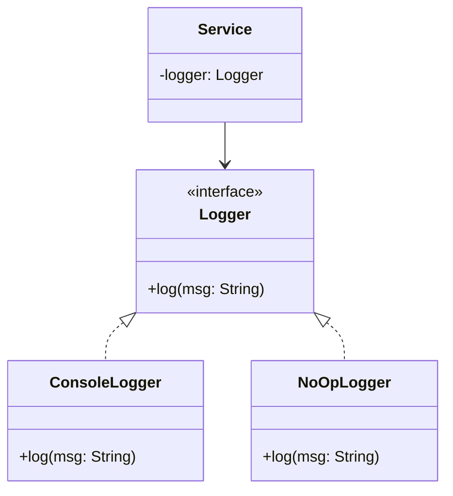

# GOF-NULL-OBJECT — Null Object Pattern

**Layer:** 2 (contextual)
**Categories:** software-design, object-oriented, design-patterns, null-safety
**Applies-to:** all

## Principle

Instead of returning or passing `null` where a collaborator is optional, provide a do-nothing object that implements the same interface but takes no action. Callers then treat the null object identically to a real object, eliminating conditional null checks throughout the codebase.

## Why it matters

Null references propagate `NullPointerException`s and `null` checks throughout codebases. Every caller must defensively check before calling any method, and callers that forget are silent bugs waiting to surface. The Null Object pattern moves the "do nothing" decision into a dedicated class, removing the need for null checks at usage sites and making the contract explicit.

## Violations to detect

- Repeated `if (x != null)` guards before calling the same method on the same collaborator in multiple places
- Methods that return `null` for an optional result type where a do-nothing implementation could be substituted
- Logging, notification, or strategy objects that are injected as `null` to disable them at runtime

## Good practice

```java
// Violation — caller must guard against null logger
if (logger != null) {
    logger.log("processing");
}

// Correct — inject a NoOpLogger that implements Logger but does nothing
class NoOpLogger implements Logger {
    @Override public void log(String msg) { /* do nothing */ }
}

// Caller is now clean
logger.log("processing");
```



- Define an interface for the optional collaborator
- Create a null/no-op implementation of the interface that performs no action
- Inject the null object when the feature is disabled or the collaborator is absent
- Prefer this over `Optional<Collaborator>` when the absent case is truly "do nothing"

## Sources

- Woolf, Bobby. "Null Object." In Martin, Robert C., Riehle, Dirk, and Buschmann, Frank, eds. *Pattern Languages of Program Design 3*. Addison-Wesley, 1998. ISBN 978-0-201-31011-5.
- Fowler, Martin. *Refactoring: Improving the Design of Existing Code*, 2nd ed. Addison-Wesley, 2018. ISBN 978-0-13-475759-9. "Introduce Special Case" (formerly Null Object).
